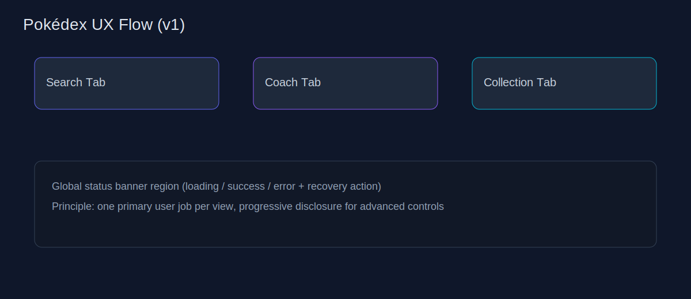
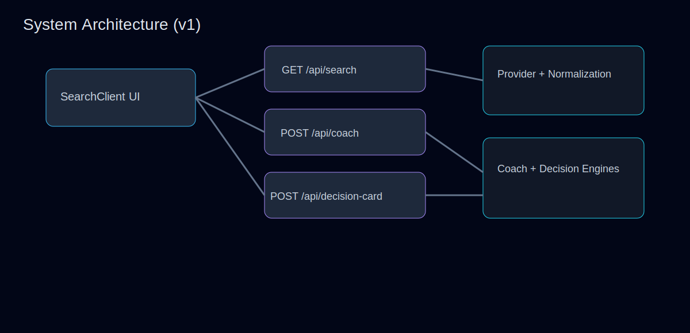

# Pokédex MVP — Pokémon TCG Finder + Coach Runtime

> A practical, test-backed Next.js app for searching live Pokémon TCG cards, guiding player decisions, and shipping safely with documented rollback controls.

---

## Why this project exists

This project helps players move from **"I have a fuzzy idea"** to **"I can act on a clear card/deck decision"** by combining:

- live card search (`/api/search`)
- structured coaching (`/api/coach`)
- readiness decisioning (`/api/decision-card`)
- deterministic behavior and release safety rails

No mock catalog is used for search results—core card discovery uses real upstream providers.

## Product UX snapshots

### Core workflow map



### System architecture



### Quality gate relay


---

## Current status at a glance

### Milestone progression

- **M1 — Coach Contract v1**
  - Established initial typed contract for coach route behavior.
  - Reference: [`docs/COACH-M1-CONTRACT-v1.md`](docs/COACH-M1-CONTRACT-v1.md)

- **M2 — Coach Core Sprint Lock**
  - Locked `coach-core.v1` contract and deterministic tie-break behavior.
  - Reference: [`docs/COACH-M2-SPRINT-LOCK-v1.md`](docs/COACH-M2-SPRINT-LOCK-v1.md)

- **M3 — Trust Layer (additive)**
  - Added `confidenceLabel` and deterministic `missingSinglesExport` without breaking base contract.
  - Reference: [`docs/COACH-M3-TRUST-LAYER-v1.md`](docs/COACH-M3-TRUST-LAYER-v1.md)

- **M4 — Tournament Variant hardening**
  - Added operational controls (timeouts, retries, rate limiting, circuit behavior, idempotency) behind runtime toggle.
  - Reference: [`docs/M4-TOURNAMENT-HANDOFF-ANDY.md`](docs/M4-TOURNAMENT-HANDOFF-ANDY.md)

- **Decision Card v1 (Milestone A release packet)**
  - Added deterministic readiness engine + explainability payload with rollback-safe variant toggle.
  - References:
    - [`docs/decision-card-v1-release-packet.md`](docs/decision-card-v1-release-packet.md)
    - [`docs/milestone-a-gate-signoff-2026-02-26.md`](docs/milestone-a-gate-signoff-2026-02-26.md)

- **Milestone B sprint lock (partial collection + owned/missing deck skeleton)**
  - Locked additive implementation scope, acceptance mapping (J8/J9/J10 + carryover actionability), and gate sequence.
  - Reference: [`docs/MILESTONE-B-SPRINT-LOCK-v1.md`](docs/MILESTONE-B-SPRINT-LOCK-v1.md)

---

## Architecture (high-level)

```text
UI (SearchClient)
   ├─ GET /api/search         -> live provider policy + normalization + ranking/cool picks
   ├─ POST /api/coach         -> coach-core.v1 (+ M3 trust layer, optional M4 tournament variant)
   └─ POST /api/decision-card -> decision_card_version=v1 deterministic readiness engine
```

### Key modules

- `components/SearchClient.tsx`
  - debounced search, stale-response guard
  - query assist, collection interactions, modal flows

- `app/api/search/route.ts`
  - query validation
  - response cache checks
  - normalized search response and stable error mapping

- `lib/pokemonApi.ts`
  - provider policy controls (`CARD_PROVIDER_PRIMARY`, optional fallback)
  - timeout/retry/suppression/cache behavior

- `app/api/coach/route.ts` + `lib/coach/*`
  - deterministic coach response path
  - M3 trust fields
  - optional M4 tournament variant hardening controls

- `app/api/decision-card/route.ts` + `lib/decisionCard/*`
  - locked v1 schema and deterministic decision logic
  - explainability payload and rollback-safe behavior

---

## Quickstart

## 1) Prerequisites

- Node.js **22+**
- npm

```bash
node -v
npm -v
```

## 2) Install

```bash
npm install
```

## 3) Configure environment

```bash
cp .env.example .env.local
```

## 4) Run locally

```bash
npm run dev
```

Open `http://localhost:3000`.

### Codespaces / mobile flow

Use:

- [`docs/CODESPACES-MOBILE-TESTING.md`](docs/CODESPACES-MOBILE-TESTING.md)
- [`docs/SPRINT-HANDOFF-TEMPLATE.md`](docs/SPRINT-HANDOFF-TEMPLATE.md)

---

## Scripts you’ll actually use

- `npm run dev` — local development
- `npm run dev:cloud` — bind `0.0.0.0:3000` for Codespaces/mobile
- `npm run dev:cloud:clean` — clean stale `.next` and restart cloud dev
- `npm run preflight:env` — detects invalid env / missing chunk startup issues
- `npm run test` — all Vitest suites
- `npm run test:contract` — UI/backend contract-focused tests
- `npm run lint` — ESLint checks
- `npm run build` — production build
- `npm run verify:live` — run local app and verify live `/api/search` behavior
- `npm run validate:tournament-env` — validate tournament variant env for M4
- `npm run eval:dexter40` — deterministic 40-query regression harness
- `npm run quality:report` — metadata quality report

---

## Feature walkthrough

### 1) Search + discovery

- Debounced text search against live provider-backed data.
- Stable empty/loading/error/result states.
- Query-aware relevance ranking + cool-picks behavior.

### 2) Card clarity

- Card detail modal supports richer metadata presentation.
- Designed to keep partial metadata rendering resilient.

### 3) Collection-aware coaching

- `/api/coach` returns deterministic actionable guidance under `coach-core.v1`.
- M3 adds trust/readiness transparency (`confidenceLabel`, missing singles export).

### 4) Decision readiness

- `/api/decision-card` returns deterministic `v1` decision state + explainability.
- Supports safe rollback response path via env toggle.

---

## API / contract highlights

## `GET /api/search?q=...`

Returns normalized card payload for UI rendering:

```json
{
  "query": "fire attacker 120",
  "results": [
    {
      "id": "sv3-27",
      "name": "Charizard",
      "image": "https://...",
      "setName": "Obsidian Flames",
      "supertype": "Pokémon",
      "types": ["Fire"],
      "hp": "180",
      "abilityText": "...",
      "attacks": [{ "name": "Burning Darkness", "damage": "180", "text": "..." }]
    }
  ],
  "coolPicks": []
}
```

Error classes:

- `400` query missing/empty
- `502` upstream unavailable/invalid
- `504` upstream timeout
- `500` unexpected internal error

## `POST /api/coach`

- Contract track: M1 → M2 (`coach-core.v1`) + additive M3 trust layer
- Optional M4 runtime variant adds header-level variant signaling (`x-coach-variant=tournament`) without contract body drift

See:

- `docs/COACH-M1-CONTRACT-v1.md`
- `docs/COACH-M2-SPRINT-LOCK-v1.md`
- `docs/COACH-M3-TRUST-LAYER-v1.md`
- `docs/M4-TOURNAMENT-HANDOFF-ANDY.md`

## `POST /api/decision-card`

- Locked `decision_card_version: "v1"`
- Deterministic readiness engine + explainability payload
- Additive partial collection intake via `collectionIntakePartial`
- Optional additive `deckSkeleton` artifact (`ownedCore`, `missingCore`, `optionalUpgrades`) gated by `DECK_SKELETON_V1_ENABLED`
- Header-level variants:
  - `x-decision-card-variant`: `v1` or `rollback-safe-default`
  - `x-deck-skeleton-variant`: `v1` or `disabled`

See: `docs/decision-card-v1-release-packet.md`

---

## Journey validation status

**Current snapshot:** local validation is green in this repo state.

Validated with:

```bash
npm run test
npm run lint
npm run build
```

Journey/acceptance-relevant suites include:

- `tests/contract.ui-backend-state.test.ts`
- `tests/ui.searchClient.test.tsx`
- `tests/coach.trust.integration.test.ts`
- `tests/coach.tournament.route.test.ts`
- `tests/decisionCard.journeyAcceptance.test.ts`

Additional release-focused checks:

```bash
npm run test -- tests/decisionCard.route.test.ts tests/decisionCard.contract.test.ts tests/decisionCard.engine.test.ts tests/decisionCard.golden.test.ts tests/decisionCard.deckSkeleton.golden.test.ts
npm run verify:live
```

---

## Release + rollback notes

### Release readiness checklist (practical)

1. `npm run test`
2. `npm run lint`
3. `npm run build`
4. If tournament mode is in scope: `npm run validate:tournament-env`
5. Confirm intended toggles in `.env.local` / deployment env

### Rollback controls

- **Decision Card v1**
  - `DECISION_CARD_V1_ENABLED=true` (default) enables v1
  - set `false`/`0` for rollback-safe response variant

- **Deck skeleton v1 (Milestone B)**
  - `DECK_SKELETON_V1_ENABLED=true` enables additive `deckSkeleton` output
  - set `false`/unset for disabled mode (`x-deck-skeleton-variant: disabled`)

- **Tournament coach variant (M4)**
  - `TOURNAMENT_VARIANT_ENABLED=true` enables tournament hardening path
  - set `false`/unset for standard variant

For tournament operations and incident handling, use:
`docs/TOURNAMENT-OPS-RUNBOOK.md`

---

## Roadmap snapshot

Current planning artifact: [`docs/ROADMAP-UPDATES-2026-02-25.md`](docs/ROADMAP-UPDATES-2026-02-25.md)

Highlights:

- P0: lock search/cool-picks UI-state contract
- P1: card detail modal depth + metadata mapping hardening
- Progressive delivery in slices (A → D) with regression hardening

---

## Documentation map

See [`docs/README.md`](docs/README.md) for a concise index of contracts, runbooks, handoff packets, and roadmap docs.

---

## Contributing

1. Branch from latest mainline.
2. Keep changes scoped and test-backed.
3. Preserve contract stability unless intentionally versioning.
4. Update docs in the same PR when behavior/contracts/toggles change.
5. Before opening PR, run:

```bash
npm run test && npm run lint && npm run build
```

If touching coach/decision-card behavior, include relevant targeted suites and note toggle impacts.

---

## License

[GNU GPL v3](LICENSE)
